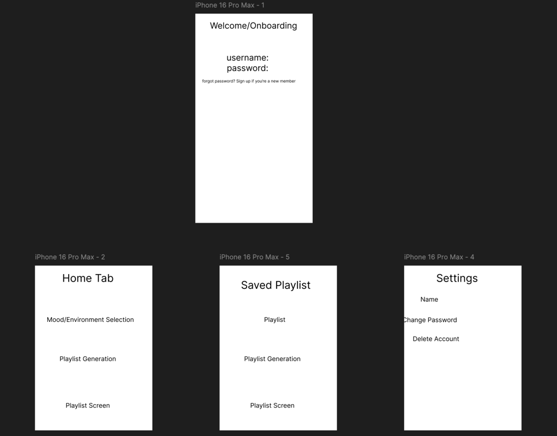

# Moodify 🎵

## Table of Contents

- [Overview](#overview)
   - [Description](#description)
   - [App Evaluation](#app-evaluation)
- [Product Spec](#product-spec)
   - [1. User Stories (Required and Optional)](#1-user-stories-required-and-optional)
   - [2. Screen Archetypes](#2-screen-archetypes)
   - [3. Navigation](#3-navigation)
- [Wireframes](#wireframes)
- [Schema](#schema)
   - [Models](#models)
   - [Networking](#networking)
- [Sprint Planning](#sprint-planning)
   - [Milestone 1: Initial Setup & User Authentication 🚀](#milestone-1-initial-setup--user-authentication-)
   - [Milestone 2: Basic UI and Data Models 🎨](#milestone-2-basic-ui-and-data-models-)
   - [Milestone 3: Integrate Mood-Based API & Networking 🌐](#milestone-3-integrate-mood-based-api--networking-)
   - [Milestone 4: Final Testing & Deployment 🧪](#milestone-4-final-testing--deployment-)
   - [Summary of Milestones and Timeline 📅](#summary-of-milestones-and-timeline-)
- [Resources 📚](#resources-)
- [Notes 🗒️](#notes-)

## Overview

### Description

**Moodify** is an application that recommends playlists or songs based on the user's current mood. Built with Java using Spring Boot for the backend, it utilizes Firebase Firestore as the database for storing user and mood data. Users can select their mood from a list, and the app will suggest appropriate playlists or songs to enhance their music experience.

### App Evaluation

- **Category**: 🎶 Music 
- **Story**: Allows users to receive music recommendations tailored to their current mood, enhancing their listening experience and discovering new music.
- **Market**: Suitable for all music enthusiasts who want personalized music recommendations based on their emotions.
- **Habit**: Users may use the app daily or whenever they wish to find music that matches their mood.
- **Scope**: Starts with mood-based recommendations and can expand to include features like saving favorite playlists, sharing moods, and integrating with various music platforms.

## Product Spec

### 1. User Stories (Required and Optional)

#### Required Must-have Stories

- [x] User can register and log in to the app.
- [ ] User can select their current mood from a predefined list.
- [ ] User receives a list of playlists or songs matching their selected mood.
- [ ] User can view details of a recommended playlist or song.
- [ ] User can save favorite moods for quick access.
- [ ] Settings screen allowing user to adjust preferences.

#### Optional Nice-to-have Stories

- [ ] User can listen to song previews within the app.
- [ ] User can share their mood and recommended playlists with friends.
- [ ] User can customize and add new moods.
- [ ] Integration with multiple music streaming services.
- [ ] User can view history of past moods and recommendations.

### 2. Screen Archetypes

- **Login/Register Screen**
   - User signs up or logs into their account.
   - Upon opening the app, the user is prompted to log in or register to access personalized features.
- **Mood Selection Screen**
   - User selects their current mood from a list.
- **Recommendations Screen**
   - Displays playlists or songs recommended based on the selected mood.
- **Playlist/Song Detail Screen**
   - Shows detailed information about the selected playlist or song.
- **Profile Screen**
   - User views and edits their profile information.
   - Accesses saved favorite moods.
- **Settings Screen**
   - User adjusts app settings, notifications, and preferences.

### 3. Navigation

#### Tab Navigation (Tab to Screen)

- **Home**
   - Mood Selection
- **Profile**
   - User Profile
   - Favorite Moods
- **Settings**
   - App Settings

#### Flow Navigation (Screen to Screen)

- **Login/Register Screen**
   - → Mood Selection Screen (after successful login/registration)
- **Mood Selection Screen**
   - → Recommendations Screen (after selecting a mood)
- **Recommendations Screen**
   - → Playlist/Song Detail Screen (upon selecting a playlist/song)
- **Profile Screen**
   - Accessed via tab bar
- **Settings Screen**
   - Accessed via tab bar or from Profile Screen

## Wireframes

**

- **Mood Selection Screen Wireframe**
- **Recommendations Screen Wireframe**
- **Playlist/Song Detail Screen Wireframe**
- **Profile Screen Wireframe**
- **Settings Screen Wireframe**

## Schema

### Models

#### **User**

| Property        | Type            | Description                                  |
|-----------------|-----------------|----------------------------------------------|
| `userId`        | String          | Unique identifier for the user               |
| `username`      | String          | User's display name                          |
| `email`         | String          | User's email address                         |
| `favoriteMoods` | Array of String | List of user's favorite moods                |
| `createdAt`     | Timestamp       | Account creation date                        |
| `updatedAt`     | Timestamp       | Last update date                             |

#### **Mood**

| Property      | Type     | Description                          |
|---------------|----------|--------------------------------------|
| `moodId`      | String   | Unique identifier for the mood       |
| `name`        | String   | Name of the mood (e.g., "Happy")     |
| `description` | String   | Description of the mood              |
| `createdAt`   | Timestamp| Date the mood was added              |

#### **UserMood** (Optional)

| Property     | Type     | Description                                     |
|--------------|----------|-------------------------------------------------|
| `userMoodId` | String   | Unique identifier for the user mood selection   |
| `userId`     | String   | Reference to the user                           |
| `moodId`     | String   | Reference to the mood                           |
| `selectedAt` | Timestamp| When the mood was selected                      |

### Networking

#### List of Network Requests by Screen

##### **Login/Register Screen**

- **(Authentication)** User logs in or registers
   - **Method**: Handled by Firebase Authentication
   - **Description**: Authenticate user credentials and access user data.

##### **Mood Selection Screen**

- **(Read/GET)** Fetch available moods
   - **Endpoint**: `GET /Moods`
   - **Description**: Retrieve the list of moods from Firestore to display to the user.

- **(Create/POST)** Record user's mood selection (Optional)
   - **Endpoint**: `POST /UserMoods`
   - **Description**: Save the user's mood selection with a timestamp.

##### **Recommendations Screen**

- **(External API)** Fetch playlists or songs based on mood
   - **Method**: `GET`
   - **Endpoint**: `/search?q={moodName}&type=playlist` (Spotify API)
   - **Description**: Fetch playlists that match the selected mood.

##### **Playlist/Song Detail Screen**

- **(External API)** Fetch playlist or song details
   - **Method**: `GET`
   - **Endpoint**: `/playlists/{playlist_id}` or `/tracks/{track_id}` (Spotify API)
   - **Description**: Retrieve detailed information about the selected playlist or song.

##### **Profile Screen**

- **(Read/GET)** Fetch user profile information
   - **Endpoint**: `GET /Users/{userId}`
   - **Description**: Retrieve user's profile data including favorite moods.

- **(Update/PUT)** Update user profile
   - **Endpoint**: `PUT /Users/{userId}`
   - **Description**: Update user's profile information in Firestore.

##### **Settings Screen**

- **No network requests required** unless settings are stored in Firestore.

#### Existing API Endpoints (Planned for Future Development)

**Spotify API**

- **Base URL**: `https://api.spotify.com/v1`

| HTTP Verb | Endpoint                           | Description                        |
|-----------|------------------------------------|------------------------------------|
| `GET`     | `/search`                          | Search for playlists based on mood |
| `GET`     | `/playlists/{playlist_id}`         | Get playlist details               |
| `GET`     | `/tracks/{track_id}`               | Get track details                  |

# Sprint Planning

## Milestone 1: Initial Setup & User Authentication 🚀
**Goal**: Set up the project infrastructure, initialize Firebase, and implement basic user authentication.

### Deliverables:

**Project Initialization:**
- Set up the GitHub repository with a project board and issues.
- Initialize the Moodify project in Java/Spring Boot.
- Configure Firebase Authentication and set up user login and registration flow.
- Create Firebase Database/Firestore structure to store user data.

**Login/Register Screen:**
- Implement the Login/Register UI.
- Create backend logic to allow user sign-up, login, and logout using Firebase Authentication.
- Handle session management (keep users logged in between sessions).

**GitHub Management:**
- Create Milestone 1 with appropriate issues.
- Assign tasks to the team.

**Due Date**: One week after project kickoff.

---

## Milestone 2: Basic UI and Data Models 🎨
**Goal**: Create the core UI and set up data models to support moods, playlists, and profiles.

### Deliverables:

**UI Development:**
- Implement the Mood Selection Screen.
- Design the Settings/Profile Screen to manage preferences and accessibility.

**Data Models:**
- Create data models for:
   - **User**: Username, email, profile picture, favorite artists, etc.
   - **Mood**: Name, description, and associated playlists.
   - **Playlist**: List of songs and metadata (e.g., mood).
   - **User Preferences**: Accessibility settings and environment context.

**Navigation Flow:**
- Implement the navigation structure between login, home, mood selection, and profile settings.
- Validate the flow between screens.

**Backend Setup:**
- Build endpoints to save user preferences, moods, and playlists in the database.
- Integrate Firebase Firestore to store user profiles and playlists.

**Due Date**: Two weeks after Milestone 1.

---

## Milestone 3: Integrate Mood-Based API & Networking 🌐
**Goal**: Implement core features where users can select moods and generate playlists. Integrate Spotify to enable seamless music playback.

### Deliverables:

**Spotify API Integration:**
- Enable Spotify login to connect the user’s Spotify account.
- Implement mood-based playlist generation using the Spotify API.

**Playlist Screen:**
- Create the Playlist Screen to display songs.
- Add functionality for play, pause, skip, and save playlists.

**Backend Logic:**
- Implement network requests to interact with Spotify and retrieve playlists based on mood.
- Add logic to detect the current environment (morning, workout) and suggest playlists.

**UI Enhancements:**
- Add a shuffle button on the Playlist Screen.
- Implement navigation between saved playlists and generated playlists.

**GitHub Management:**
- Create Milestone 3 with detailed issues for Spotify integration and networking tasks.

**Due Date**: Two weeks after Milestone 2.

---

## Milestone 4: Final Testing & Deployment 🧪
**Goal**: Complete the app by testing all features and deploying the final version.

### Deliverables:

**Testing & Bug Fixes:**
- Test all navigation flows to ensure smooth transitions between screens.
- Fix any bugs encountered during testing.

**UI Polishing:**
- Ensure that all screens are visually aligned and consistent.
- Add any optional features if time permits (e.g., collaborative playlists, community page).

**Final Touches:**
- Optimize playlist performance and fix any delays in Spotify playback.
- Add error handling for network issues (e.g., failed Spotify login).

**Deployment:**
- Prepare the project for deployment.
- Create a release version and push the final build to GitHub.

**GitHub Management:**
- Close all milestones and issues.
- Ensure all documentation is complete in the README.

**Due Date**: Two weeks after Milestone 3.

---

## Summary of Milestones and Timeline 📅

- **Milestone 1**: Initial Setup & User Authentication
   - **Due**: One week from project start
   - **Focus**: Firebase setup, Login/Register, initial project setup.

- **Milestone 2**: Basic UI and Data Models
   - **Due**: Two weeks after Milestone 1
   - **Focus**: UI development, data models, navigation.

- **Milestone 3**: Integrate Mood-Based API & Networking
   - **Due**: Two weeks after Milestone 2
   - **Focus**: Spotify integration, playlist generation, backend logic.

- **Milestone 4**: Final Testing & Deployment
   - **Due**: Two weeks after Milestone 3
   - **Focus**: Bug fixes, UI polishing, final deployment.

---

